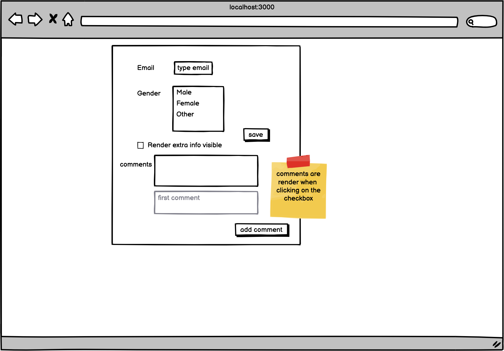

# README #

Welcome to Ulegalize Academy

### Create a Proof of Concept ReactJs ###

In order to have a first approach before the training , you could fork and create 

## POC
###
use libraries from package.json

### Statement ###
2 peoples must communicate each others
Provide a discussion between them.  

Here is a mock to reproduce

### Contribution guidelines ###

* Writing tests
* Code review
* Other guidelines

### Who do I talk to? ###

* Repo owner or admin
* Other community or team contact